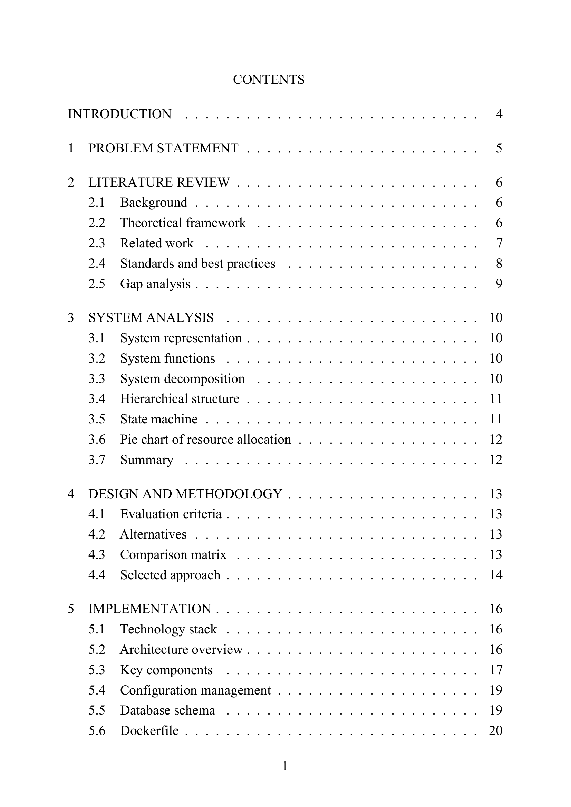
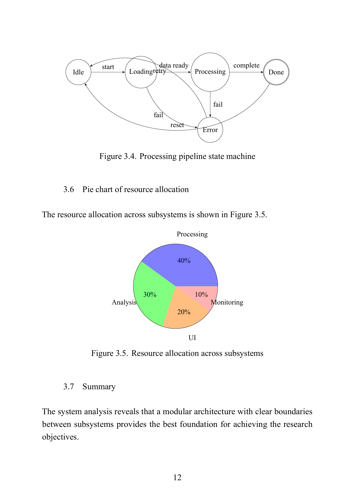
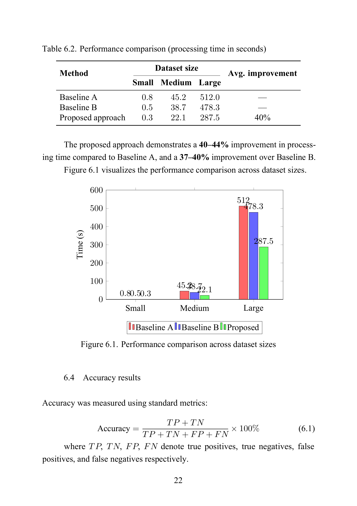

<div align="center">
  <h1>tex-thesis</h1>
  <p><b>A universal, modern LaTeX thesis template for bachelor's, master's, or PhD theses.</b></p>

  [](https://github.com/Amet13/tex-thesis/actions/workflows/actions.yml)
  [](https://github.com/pre-commit/pre-commit)
  [](LICENSE-GPL)
  [](LICENSE-CC-BY-SA)

  [](https://github.com/Amet13/tex-thesis/stargazers)
  [](https://github.com/Amet13/tex-thesis/network/members)
  [](https://github.com/Amet13/tex-thesis/releases/latest)

  <br />

  [**View Thesis PDF**](https://github.com/Amet13/tex-thesis/releases/latest/download/thesis.pdf) •
  [**View Slides PDF**](https://github.com/Amet13/tex-thesis/releases/latest/download/slides.pdf)

  <br />

  <p align="center">
    
    
    
  </p>
</div>

---

## Why this template?

Writing a thesis is hard enough without fighting LaTeX errors. This template provides a **production-ready, modern LaTeX environment** out of the box. It uses a current package stack (`LuaLaTeX`, `biblatex`, `pgfplots`, `cleveref`) and comes with a fully configured **Docker build system** and **VS Code Dev Container**.

You don't need to install a 4GB TeX Live distribution on your machine. Just open the project, write your content, and let the automation handle the rest.

## Who is this for?

- **Students** writing bachelor's, master's, or PhD theses in any technical field
- **LaTeX beginners** who want a working, well-documented template instead of starting from scratch
- **Researchers** who need reproducible, version-controlled document builds
- **Advisors** who want consistent formatting from their students

## Features

- **Modern Engine**: Uses `LuaLaTeX` for native UTF-8 support, system fonts, and advanced microtypography (`microtype`).
- **Professional Typography**: Times New Roman (14pt, 1.5 spacing), XITS Math for formulas, and FreeMono for code.
- **Data Visualization**: High-quality plots with `pgfplots` and programmatic diagrams with `TikZ`.
- **Smart Referencing**: Modern bibliography with `biblatex`/`biber` and intelligent cross-referencing with `cleveref`.
- **Developer Experience**: Zero-setup environment using **VS Code Dev Containers** and a fast multi-stage **Docker** build.
- **Code Quality**: Built-in `chktex` linting, `latexindent` formatting, and `pre-commit` hooks to keep your LaTeX source clean.
- **Reproducible Automation**: Pinned Docker and CI dependencies with automated updates through Dependabot.
- **Defense Ready**: Includes a matching Beamer presentation template for your final defense.

## How does it compare?

| Feature                     | tex-thesis | Overleaf  | Local TeX Live | Word / Docs |
|-----------------------------|:----------:|:---------:|:--------------:|:-----------:|
| Zero-install setup          | Docker     | Browser   | 4GB download   | Browser     |
| CI/CD pipeline              | GitHub Actions | --    | --             | --          |
| Linting & formatting        | chktex + latexindent | -- | Manual     | Spell check |
| Reproducible Docker build   | Multi-stage | --       | --             | --          |
| Version control friendly    | Plain text | Limited   | Plain text     | Binary      |
| Defense slides included     | Beamer     | Separate  | Separate       | Separate    |
| Free and open source        | GPLv3      | Freemium  | Free           | Freemium    |
| Offline capable             | Yes        | No        | Yes            | No          |

## Quick Start

You can use this template instantly in your browser/editor, or locally with Docker.

### Option 1: VS Code Dev Containers (Recommended)

The easiest way to get started without installing LaTeX locally:

1. Install [VS Code](https://code.visualstudio.com/) and [Docker](https://docs.docker.com/get-docker/).
2. Install the [Dev Containers extension](https://marketplace.visualstudio.com/items?itemName=ms-vscode-remote.remote-containers).
3. Clone and open this repository in VS Code.
4. Click **Reopen in Container** when prompted.
5. Open `main.tex` and save it — the PDF will build automatically!

### Option 2: Local Docker Build

If you prefer using the terminal:

```bash
# 1. Clone the repository
git clone https://github.com/Amet13/tex-thesis.git
cd tex-thesis/

# 2. Build the PDFs (thesis.pdf and slides/slides.pdf)
make build

# 3. Watch for changes and rebuild automatically
make watch
```

**Available Commands:**
- `make build` — Build thesis and slides.
- `make build-thesis` — Build thesis only.
- `make build-slides` — Build slides only.
- `make watch` / `make watch-thesis` — Rebuild thesis on file changes.
- `make watch-slides` — Rebuild slides on file changes.
- `make lint` — Run `chktex` linter.
- `make fmt` — Format `.tex` files with `latexindent`.
- `make fmt-check` — Check formatting without changing files.
- `make check` — Run all quality checks (lint + format check).
- `make clean` — Remove generated PDFs and auxiliary files.

## Compatibility Matrix

| Component  | Supported / Recommended                |
|------------|----------------------------------------|
| Build mode | Docker (recommended), Dev Container    |
| TeX engine | LuaLaTeX (`latexmk` + `biber`)         |
| OS         | macOS, Linux, Windows (via Docker/WSL) |
| Editor     | VS Code + LaTeX Workshop               |

## Troubleshooting

| Symptom                                 | Action                                                         |
|-----------------------------------------|----------------------------------------------------------------|
| Build fails with missing package/font   | Run `make build` (Docker build includes required dependencies) |
| Lint fails only locally                 | Run `make lint` in Dev Container or rely on Docker fallback    |
| Formatting differs between contributors | Run `make fmt` and commit changes                              |
| CI fails but local succeeds             | Check pinned dependency updates in Dependabot PRs and rerun    |

## Project Docs

- Changelog: [CHANGELOG.md](CHANGELOG.md)
- Security: [SECURITY.md](SECURITY.md)

## Project Structure

```text
tex-thesis/
├── main.tex              # Main thesis document (includes chapters)
├── preamble.tex          # LaTeX packages, fonts, and styling config
├── references.bib        # Bibliography database (BibTeX)
├── chapters/             # Thesis content (Introduction, Literature, etc.)
├── images/               # Figures and diagrams
├── slides/               # Beamer presentation for defense
│   ├── main.tex          # Main slides document
│   └── slides.tex        # Slides content
├── Makefile              # Build automation commands
└── .devcontainer/        # VS Code container configuration
```

## Adapting for Your Thesis

1. **Configure**: Edit `preamble.tex` to adjust formatting (margins, fonts, spacing) and PDF metadata.
2. **Write**: Replace the `.tex` files in the `chapters/` directory with your own content.
3. **Cite**: Update `references.bib` with your bibliography entries.
4. **Present**: Modify `slides/main.tex` (author, title) and `slides/slides.tex` (content) for your defense.

## Showcase

The template includes working examples of almost every LaTeX feature you might need. Look for the `% === EXAMPLE: ... ===` comments in the source code!

- **Math**: Inline math, numbered equations, aligned multi-line equations, matrices, integrals, piecewise functions.
- **Plots & Diagrams**: Architecture diagrams, flowcharts, Gantt timelines, bar charts, and line plots (`pgfplots`).
- **Tables**: Professional academic tables (`booktabs`), decimal alignment (`siunitx`), and multi-row cells.
- **Code**: Syntax-highlighted listings for Python, SQL, JSON, and Dockerfiles (`listings`, `xcolor`).
- **Images**: Single figures, side-by-side subfigures (`subcaption`), and custom image insertion commands.

## Contributing

Contributions are welcome! Whether it's a new TikZ example, a bug fix, or a documentation improvement.

1. Fork the repository.
2. Make your changes.
3. Run `make pre-commit` and `make lint` to ensure code quality.
4. Open a Pull Request.

See [CONTRIBUTING.md](CONTRIBUTING.md) for detailed guidelines.

## Versioning

This template follows semantic versioning for tagged releases.

- Patch: bug fixes and non-breaking docs/tooling updates
- Minor: backward-compatible template features and examples
- Major: breaking template or workflow changes

## License

This project uses dual licensing:

- **Source Code**: [GNU GPLv3](LICENSE-GPL) — Makefile, Dockerfile, CI/CD, scripts
- **Template Content**: [CC BY-SA 4.0](LICENSE-CC-BY-SA) — `.tex`, `.bib`, `.sty` files, images, slides

See [LICENSE](LICENSE) for details. Your own thesis content is yours.

---

[](https://star-history.com/#Amet13/tex-thesis&Date)
